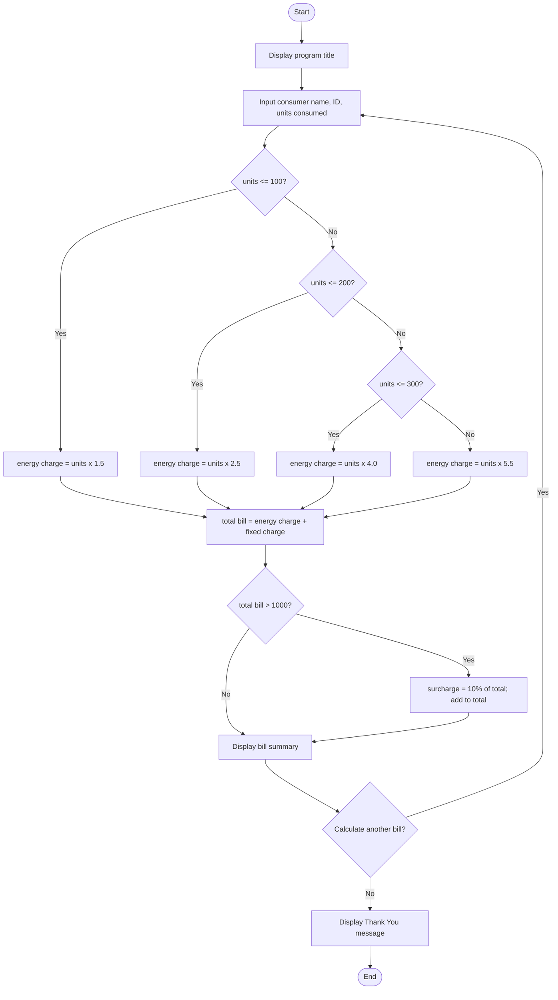
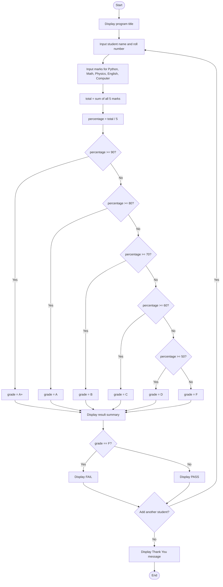

# Python_PBL_1

Beginner Python mini-projects built as part of a Project-Based Learning (PBL) module in class. Each project is a self-contained console application focused on practicing core Python fundamentals — input/output, conditionals, loops, and arithmetic.

## Overview

| Project | File | Description |
|---|---|---|
| Electricity Bill Calculator | `electric_bill.py` | Calculates an electricity bill from units consumed using slab-based pricing |
| Student Grade Management System | `student_grade_management.py` | Records student marks across 5 subjects and calculates percentage, grade, and pass/fail status |

## Projects

### 1. Electricity Bill Calculator (`electric_bill.py`)

Calculates a consumer's electricity bill based on units consumed, using a slab (tiered) pricing system.

**Features**
- Takes consumer name, consumer ID, and units consumed as input
- Applies slab-based energy charges
- Adds a fixed charge, plus a surcharge on bills over ₹1000
- Prints a formatted bill summary
- Runs in a loop so multiple bills can be generated in one session

**Billing rules**

| Units Consumed | Rate per Unit |
|---|---|
| 0 – 100 | ₹1.5 |
| 101 – 200 | ₹2.5 |
| 201 – 300 | ₹4.0 |
| Above 300 | ₹5.5 |

- Fixed charge: ₹100 (added to every bill)
- Surcharge: 10% of the bill, applied only if the total exceeds ₹1000

**Flowchart**
 

 
**Algorithm**
 
1. Start.
2. Display the program title.
3. Input consumer name, consumer ID, and units consumed.
4. If units ≤ 100, set energy charge = units × 1.5.
5. Else if units ≤ 200, set energy charge = units × 2.5.
6. Else if units ≤ 300, set energy charge = units × 4.0.
7. Else, set energy charge = units × 5.5.
8. Set total bill = energy charge + fixed charge (₹100).
9. If total bill > 1000, set surcharge = 10% of total bill and add it to total bill.
10. Display consumer details, energy charge, fixed charge, surcharge, and total bill.
11. Ask the user if they want to calculate another bill.
12. If the answer is "yes", repeat from step 3.
13. Display "Thank You!" and stop.


**Sample run**
```
======================================
 ELECTRICITY BILL CALCULATOR
======================================

Enter Consumer Name : Rahul Sharma
Enter Consumer ID : C001
Enter Units Consumed : 250

========== ELECTRICITY BILL ==========
Consumer Name : Rahul Sharma
Consumer ID : C001
Units Used : 250.0
Energy Charge : ₹ 1000.0
Fixed Charge : ₹ 100
Surcharge : ₹ 110.0
--------------------------------------
Total Bill : ₹ 1210.0
======================================

Calculate another bill? (yes/no): no

Thank You!
```

### 2. Student Grade Management System (`student_grade_management.py`)

Records a student's marks across five subjects and evaluates their overall performance.

**Features**
- Takes student name, roll number, and marks (out of 100) for Python, Math, Physics, English, and Computer
- Calculates total marks and percentage
- Assigns a letter grade based on percentage
- Declares a PASS/FAIL result
- Runs in a loop so multiple students can be entered in one session

**Grading scale**

| Percentage | Grade |
|---|---|
| 90 and above | A+ |
| 80 – 89 | A |
| 70 – 79 | B |
| 60 – 69 | C |
| 50 – 59 | D |
| Below 50 | F (Fail) |

**Flowchart**
 

 
**Algorithm**
 
1. Start.
2. Display the program title.
3. Input student name and roll number.
4. Input marks (out of 100) for Python, Math, Physics, English, and Computer.
5. Calculate total marks = sum of all 5 subject marks.
6. Calculate percentage = total marks / 5.
7. If percentage ≥ 90, set grade = A+.
8. Else if percentage ≥ 80, set grade = A.
9. Else if percentage ≥ 70, set grade = B.
10. Else if percentage ≥ 60, set grade = C.
11. Else if percentage ≥ 50, set grade = D.
12. Else, set grade = F.
13. Display student name, roll number, total marks, percentage, and grade.
14. If grade = F, display "FAIL"; else display "PASS".
15. Ask the user if they want to add another student.
16. If the answer is "yes", repeat from step 3.
17. Display "Thank You" and stop.

**Sample run**
```
===================================
 STUDENT GRADE MANAGEMENT SYSTEM
===================================
Enter Student Name : Ananya Roy
Enter Roll Number : 21

Enter Marks (Out of 100)
Python : 85
Math : 90
Physics : 78
English : 88
Computer : 95

========== RESULT ==========
Student Name : Ananya Roy
Roll Number : 21
Total Marks : 436.0
Percentage : 87.2 %
Grade : A
Result : PASS

Do you want to add another student? (yes/no): no

Thank You
```

## Concepts Practiced

- Conditional statements (`if` / `elif` / `else`)
- `while` loops for repeated program runs
- Taking user input (`input()`, `float()`)
- Basic arithmetic and percentage calculations
- Formatted console output

## Tech Stack

- **Language:** Python 3
- **Dependencies:** None — uses only Python's built-in functions

## Getting Started

**Prerequisites:** Python 3 installed on your system

```bash
# Clone the repository
git clone https://github.com/INSANE0PAPA/Python_PBL_1.git
cd Python_PBL_1

# Run a project
python electric_bill.py
# or
python student_grade_management.py
```

## Repository Structure

```
Python_PBL_1/
├── electric_bill.py
├── student_grade_management.py
└── README.md
```

## Author

[SHRIJIT MUKHERJEE](https://github.com/INSANE0PAPA)
